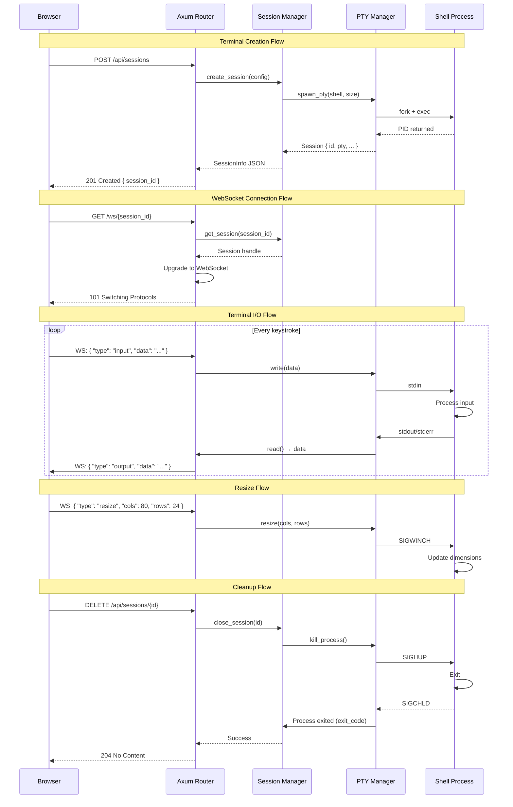

# Web Terminal System Architecture

**Version:** 1.0
**Status:** Design Document
**Last Updated:** 2025-09-29

---

## Table of Contents

1. [System Overview](#system-overview)
2. [Architecture Diagrams](#architecture-diagrams)
3. [Component Architecture](#component-architecture)
4. [Communication Protocol](#communication-protocol)
5. [API Design](#api-design)
6. [Data Structures](#data-structures)
7. [Error Handling Strategy](#error-handling-strategy)
8. [Concurrency Model](#concurrency-model)
9. [Resource Cleanup Strategy](#resource-cleanup-strategy)
10. [Proxy Compatibility](#proxy-compatibility)
11. [Architecture Decision Records](#architecture-decision-records)

---

## System Overview

### Core Principles

1. **Single-Port Architecture**: All services (HTTP, WebSocket, static assets) operate on one port
2. **Relative Routing**: All paths are relative to support reverse proxy deployments
3. **Process Lifecycle Management**: Robust spawn → monitor → cleanup pipeline
4. **Session Multiplexing**: Support multiple concurrent terminal sessions
5. **Graceful Degradation**: Automatic reconnection and error recovery

### Quality Attributes

| Attribute | Target | Strategy |
|-----------|--------|----------|
| **Performance** | <50ms latency | Async I/O, zero-copy buffers |
| **Scalability** | 100+ concurrent sessions | Connection pooling, resource limits |
| **Reliability** | 99.9% uptime | Health checks, auto-recovery |
| **Security** | Process isolation | PTY sandboxing, input validation |
| **Maintainability** | <500 LOC per module | Clean architecture, separation of concerns |

### Technology Stack

```
┌─────────────────────────────────────────────┐
│              Frontend Layer                  │
│  ┌──────────────┐  ┌──────────────┐         │
│  │   xterm.js   │  │ WASM Client  │         │
│  │  (Terminal)  │  │ (WebSocket)  │         │
│  └──────────────┘  └──────────────┘         │
└─────────────────────────────────────────────┘
                     │
              WebSocket + HTTP
                     │
┌─────────────────────────────────────────────┐
│             Backend Layer (Rust)             │
│  ┌──────────────────────────────────────┐   │
│  │         Axum HTTP Server             │   │
│  │  ┌────────────┐  ┌──────────────┐   │   │
│  │  │ Static     │  │  WebSocket   │   │   │
│  │  │ Assets     │  │  Handler     │   │   │
│  │  └────────────┘  └──────────────┘   │   │
│  └──────────────────────────────────────┘   │
│                                              │
│  ┌──────────────────────────────────────┐   │
│  │      Session Manager                 │   │
│  │  ┌────────────┐  ┌──────────────┐   │   │
│  │  │  Session   │  │   Process    │   │   │
│  │  │   Store    │  │   Monitor    │   │   │
│  │  └────────────┘  └──────────────┘   │   │
│  └──────────────────────────────────────┘   │
│                                              │
│  ┌──────────────────────────────────────┐   │
│  │         PTY Manager                  │   │
│  │  ┌────────────┐  ┌──────────────┐   │   │
│  │  │  Process   │  │   SIGCHLD    │   │   │
│  │  │  Spawner   │  │   Handler    │   │   │
│  │  └────────────┘  └──────────────┘   │   │
│  └──────────────────────────────────────┘   │
└─────────────────────────────────────────────┘
                     │
                PTY Interface
                     │
┌─────────────────────────────────────────────┐
│          Operating System Layer              │
│  ┌──────────────┐  ┌──────────────┐         │
│  │   Shell      │  │   Process    │         │
│  │  (bash/zsh)  │  │   Group      │         │
│  └──────────────┘  └──────────────┘         │
└─────────────────────────────────────────────┘
```

---

## Architecture Diagrams

### High-Level System Diagram

```
┌────────────────────────────────────────────────────────────────────┐
│                          Reverse Proxy                             │
│                     (Optional: nginx, Apache)                      │
│                    Path: /terminal/* → :8080/                      │
└────────────────────────────────────────────────────────────────────┘
                                  │
                                  ▼
┌────────────────────────────────────────────────────────────────────┐
│                        Single Port (8080)                          │
│  ┌──────────────────────────────────────────────────────────────┐ │
│  │                      Axum Router                             │ │
│  │  ┌─────────────┐  ┌──────────────┐  ┌──────────────────┐   │ │
│  │  │   Static    │  │  REST API    │  │   WebSocket      │   │ │
│  │  │   Handler   │  │   Handler    │  │   Upgrade        │   │ │
│  │  │             │  │              │  │                  │   │ │
│  │  │ GET /       │  │ /api/*       │  │ GET /ws/:id      │   │ │
│  │  │ GET /assets │  │              │  │ Upgrade: ws      │   │ │
│  │  └─────────────┘  └──────────────┘  └──────────────────┘   │ │
│  └──────────────────────────────────────────────────────────────┘ │
└────────────────────────────────────────────────────────────────────┘
            │                      │                       │
            │                      │                       │
            ▼                      ▼                       ▼
    ┌──────────────┐     ┌─────────────────┐    ┌──────────────────┐
    │   Frontend   │     │  Session API    │    │  WebSocket Conn  │
    │   (HTML/JS)  │     │   (JSON)        │    │  (Binary/Text)   │
    └──────────────┘     └─────────────────┘    └──────────────────┘
                                  │                       │
                                  ▼                       ▼
                         ┌─────────────────────────────────────┐
                         │      Session Manager                │
                         │  ┌────────────────────────────┐     │
                         │  │  HashMap<SessionId, PTY>   │     │
                         │  └────────────────────────────┘     │
                         │  ┌────────────────────────────┐     │
                         │  │  Arc<RwLock<Sessions>>     │     │
                         │  └────────────────────────────┘     │
                         └─────────────────────────────────────┘
                                        │
                                        ▼
                         ┌─────────────────────────────────────┐
                         │       PTY Manager                   │
                         │  ┌────────────────────────────┐     │
                         │  │  portable-pty              │     │
                         │  │  - Master PTY              │     │
                         │  │  - Read/Write Streams      │     │
                         │  │  - Process Handle          │     │
                         │  └────────────────────────────┘     │
                         └─────────────────────────────────────┘
                                        │
                                        ▼
                         ┌─────────────────────────────────────┐
                         │    OS Process (Shell)               │
                         │    - bash/zsh/fish                  │
                         │    - Environment variables          │
                         │    - Working directory              │
                         └─────────────────────────────────────┘
```

### Component Interaction Flow



---

## Component Architecture

### 1. Backend Architecture (Rust)

#### 1.1 Main Server Module

**Responsibilities:**
- Initialize Tokio async runtime
- Configure Axum router with all routes
- Bind to configured port
- Handle graceful shutdown on SIGTERM/SIGINT

**Key Dependencies:**
```toml
tokio = { version = "1.40", features = ["full"] }
axum = { version = "0.7", features = ["ws"] }
tower = "0.5"
tower-http = { version = "0.6", features = ["fs", "cors"] }
```

**Main Function Flow:**
```rust
async fn main() -> Result<()> {
    // 1. Initialize logging
    tracing_subscriber::init();

    // 2. Create shared state
    let state = Arc::new(AppState::new());

    // 3. Build router with all routes
    let app = Router::new()
        .route("/", get(serve_index))
        .route("/api/config", get(get_config))
        .route("/api/sessions", get(list_sessions).post(create_session))
        .route("/api/sessions/:id", delete(close_session))
        .route("/ws/:session_id", get(websocket_handler))
        .nest_service("/assets", ServeDir::new("static"))
        .with_state(state)
        .layer(CorsLayer::permissive());

    // 4. Bind and serve
    let addr = SocketAddr::from(([0, 0, 0, 0], 8080));
    let listener = TcpListener::bind(addr).await?;

    // 5. Setup shutdown signal handler
    let shutdown = async {
        tokio::signal::ctrl_c().await.ok();
        tracing::info!("Shutdown signal received");
    };

    // 6. Serve with graceful shutdown
    axum::serve(listener, app)
        .with_graceful_shutdown(shutdown)
        .await?;

    Ok(())
}
```

#### 1.2 Session Manager Module

**Responsibilities:**
- Maintain active session registry
- Create new terminal sessions
- Close and cleanup sessions
- Provide session lookup
- Handle concurrent access with RwLock

**Data Structure:**
```rust
pub struct SessionManager {
    sessions: Arc<RwLock<HashMap<SessionId, Session>>>,
    config: SessionConfig,
}

pub struct Session {
    id: SessionId,
    pty: Box<dyn PtyMaster>,
    created_at: Instant,
    last_activity: Arc<RwLock<Instant>>,
    writer: Arc<Mutex<Box<dyn Write + Send>>>,
    reader: Arc<Mutex<Box<dyn Read + Send>>>,
    process: Arc<Mutex<Child>>,
}

#[derive(Debug, Clone, Copy, PartialEq, Eq, Hash)]
pub struct SessionId(Uuid);
```

**Key Operations:**
```rust
impl SessionManager {
    pub async fn create_session(
        &self,
        shell: Option<String>,
        size: TerminalSize,
    ) -> Result<SessionInfo> {
        // 1. Generate unique session ID
        let session_id = SessionId::new();

        // 2. Spawn PTY with configured shell
        let pty = self.spawn_pty(shell, size)?;

        // 3. Create session structure
        let session = Session {
            id: session_id,
            pty,
            created_at: Instant::now(),
            last_activity: Arc::new(RwLock::new(Instant::now())),
            // ... other fields
        };

        // 4. Store in registry
        let mut sessions = self.sessions.write().await;
        sessions.insert(session_id, session);

        Ok(SessionInfo { id: session_id, /* ... */ })
    }

    pub async fn get_session(&self, id: SessionId) -> Option<Session> {
        let sessions = self.sessions.read().await;
        sessions.get(&id).cloned()
    }

    pub async fn close_session(&self, id: SessionId) -> Result<()> {
        // 1. Remove from registry
        let session = {
            let mut sessions = self.sessions.write().await;
            sessions.remove(&id)
        };

        // 2. Cleanup if exists
        if let Some(session) = session {
            session.cleanup().await?;
        }

        Ok(())
    }

    pub async fn list_sessions(&self) -> Vec<SessionInfo> {
        let sessions = self.sessions.read().await;
        sessions.values()
            .map(|s| s.to_info())
            .collect()
    }
}
```

#### 1.3 PTY Manager Module

**Responsibilities:**
- Spawn PTY processes
- Handle PTY I/O (read/write)
- Process resize operations
- Monitor child process lifecycle
- Handle SIGCHLD signals
- Propagate exit codes

**Implementation:**
```rust
use portable_pty::{native_pty_system, CommandBuilder, PtySize};

pub struct PtyManager {
    pty_system: Box<dyn PtySystem>,
}

impl PtyManager {
    pub fn spawn_pty(
        &self,
        shell: Option<String>,
        size: TerminalSize,
    ) -> Result<PtySession> {
        // 1. Create PTY pair
        let pty_pair = self.pty_system.openpty(PtySize {
            rows: size.rows,
            cols: size.cols,
            pixel_width: 0,
            pixel_height: 0,
        })?;

        // 2. Configure shell command
        let shell = shell.or_else(|| std::env::var("SHELL").ok())
            .unwrap_or_else(|| "/bin/bash".to_string());

        let mut cmd = CommandBuilder::new(shell);
        cmd.env("TERM", "xterm-256color");

        // 3. Spawn child process
        let child = pty_pair.slave.spawn_command(cmd)?;

        // 4. Setup I/O handles
        let master = pty_pair.master;
        let reader = master.try_clone_reader()?;
        let writer = master.take_writer()?;

        Ok(PtySession {
            master,
            reader: Arc::new(Mutex::new(reader)),
            writer: Arc::new(Mutex::new(writer)),
            child: Arc::new(Mutex::new(child)),
        })
    }

    pub async fn resize(
        &self,
        session: &PtySession,
        size: TerminalSize,
    ) -> Result<()> {
        session.master.resize(PtySize {
            rows: size.rows,
            cols: size.cols,
            pixel_width: 0,
            pixel_height: 0,
        })?;
        Ok(())
    }

    pub async fn kill_process(&self, session: &PtySession) -> Result<()> {
        let mut child = session.child.lock().await;
        child.kill()?;
        child.wait()?;
        Ok(())
    }
}
```

#### 1.4 WebSocket Handler Module

**Responsibilities:**
- Upgrade HTTP connections to WebSocket
- Bidirectional message routing
- Handle protocol messages (input, output, resize, control)
- Connection lifecycle management
- Error handling and reconnection support

**Implementation:**
```rust
pub async fn websocket_handler(
    ws: WebSocketUpgrade,
    Path(session_id): Path<SessionId>,
    State(state): State<Arc<AppState>>,
) -> Response {
    ws.on_upgrade(move |socket| handle_socket(socket, session_id, state))
}

async fn handle_socket(
    socket: WebSocket,
    session_id: SessionId,
    state: Arc<AppState>,
) -> Result<()> {
    // 1. Get session
    let session = state.session_manager
        .get_session(session_id)
        .await
        .ok_or(Error::SessionNotFound)?;

    // 2. Split socket into sender/receiver
    let (mut sender, mut receiver) = socket.split();

    // 3. Spawn PTY reader task
    let reader_handle = {
        let session = session.clone();
        tokio::spawn(async move {
            let mut reader = session.reader.lock().await;
            let mut buf = [0u8; 8192];

            loop {
                match reader.read(&mut buf).await {
                    Ok(n) if n > 0 => {
                        let msg = Message::Binary(buf[..n].to_vec());
                        if sender.send(msg).await.is_err() {
                            break;
                        }
                    }
                    _ => break,
                }
            }
        })
    };

    // 4. Handle incoming WebSocket messages
    while let Some(Ok(msg)) = receiver.next().await {
        match msg {
            Message::Text(text) => {
                let cmd: TerminalMessage = serde_json::from_str(&text)?;
                handle_message(cmd, &session).await?;
            }
            Message::Binary(data) => {
                // Raw terminal input
                let mut writer = session.writer.lock().await;
                writer.write_all(&data).await?;
                writer.flush().await?;
            }
            Message::Close(_) => break,
            _ => {}
        }
    }

    // 5. Cleanup
    reader_handle.abort();
    Ok(())
}

async fn handle_message(
    msg: TerminalMessage,
    session: &Session,
) -> Result<()> {
    match msg {
        TerminalMessage::Input { data } => {
            let mut writer = session.writer.lock().await;
            writer.write_all(data.as_bytes()).await?;
            writer.flush().await?;
        }
        TerminalMessage::Resize { cols, rows } => {
            session.resize(TerminalSize { cols, rows }).await?;
        }
        TerminalMessage::Ping => {
            // Update last activity
            let mut last = session.last_activity.write().await;
            *last = Instant::now();
        }
    }
    Ok(())
}
```

### 2. Frontend Architecture (WASM + JavaScript)

#### 2.1 Terminal UI Module (JavaScript)

**Responsibilities:**
- Initialize xterm.js terminal instances
- Manage terminal lifecycle (create, attach, destroy)
- Handle user input and forward to backend
- Render terminal output
- Manage terminal multiplexing UI (tabs/splits)

**Implementation:**
```javascript
import { Terminal } from 'xterm';
import { FitAddon } from 'xterm-addon-fit';
import { WebLinksAddon } from 'xterm-addon-web-links';
import { WasmWebSocket } from './wasm-client';

export class TerminalManager {
    constructor() {
        this.terminals = new Map();
        this.baseUrl = this.detectBaseUrl();
    }

    detectBaseUrl() {
        // Support proxy paths like /proxy-prefix/
        return window.location.pathname.replace(/\/(index\.html)?$/, '');
    }

    async createTerminal(containerId) {
        // 1. Create terminal instance
        const terminal = new Terminal({
            cursorBlink: true,
            fontSize: 14,
            fontFamily: 'Menlo, Monaco, "Courier New", monospace',
            theme: {
                background: '#1e1e1e',
                foreground: '#d4d4d4',
            },
            scrollback: 10000,
        });

        // 2. Add addons
        const fitAddon = new FitAddon();
        terminal.loadAddon(fitAddon);
        terminal.loadAddon(new WebLinksAddon());

        // 3. Create backend session
        const response = await fetch(`${this.baseUrl}/api/sessions`, {
            method: 'POST',
            headers: { 'Content-Type': 'application/json' },
            body: JSON.stringify({
                shell: null,
                size: {
                    cols: terminal.cols,
                    rows: terminal.rows,
                },
            }),
        });

        if (!response.ok) {
            throw new Error('Failed to create session');
        }

        const { session_id } = await response.json();

        // 4. Open WebSocket connection
        const wsUrl = `${this.getWsUrl()}/ws/${session_id}`;
        const ws = new WasmWebSocket(wsUrl);

        // 5. Attach terminal to container
        const container = document.getElementById(containerId);
        terminal.open(container);
        fitAddon.fit();

        // 6. Setup bidirectional data flow
        terminal.onData(data => {
            ws.send(JSON.stringify({
                type: 'input',
                data: data,
            }));
        });

        ws.onMessage(msg => {
            if (msg instanceof ArrayBuffer) {
                terminal.write(new Uint8Array(msg));
            } else {
                const data = JSON.parse(msg);
                if (data.type === 'output') {
                    terminal.write(data.data);
                }
            }
        });

        // 7. Handle resize
        const resizeObserver = new ResizeObserver(() => {
            fitAddon.fit();
            ws.send(JSON.stringify({
                type: 'resize',
                cols: terminal.cols,
                rows: terminal.rows,
            }));
        });
        resizeObserver.observe(container);

        // 8. Store reference
        this.terminals.set(session_id, {
            terminal,
            ws,
            sessionId: session_id,
            fitAddon,
            resizeObserver,
        });

        return session_id;
    }

    getWsUrl() {
        const protocol = window.location.protocol === 'https:' ? 'wss:' : 'ws:';
        return `${protocol}//${window.location.host}${this.baseUrl}`;
    }

    async closeTerminal(sessionId) {
        const term = this.terminals.get(sessionId);
        if (!term) return;

        // 1. Close WebSocket
        term.ws.close();

        // 2. Cleanup observers
        term.resizeObserver.disconnect();

        // 3. Dispose terminal
        term.terminal.dispose();

        // 4. Delete backend session
        await fetch(`${this.baseUrl}/api/sessions/${sessionId}`, {
            method: 'DELETE',
        });

        // 5. Remove from map
        this.terminals.delete(sessionId);
    }

    async listTerminals() {
        const response = await fetch(`${this.baseUrl}/api/sessions`);
        return await response.json();
    }
}
```

#### 2.2 WASM WebSocket Client Module

**Responsibilities:**
- WebSocket connection management
- Automatic reconnection logic
- Message serialization/deserialization
- Connection state tracking
- Error handling

**Implementation (Rust → WASM):**
```rust
use wasm_bindgen::prelude::*;
use web_sys::{WebSocket, MessageEvent, ErrorEvent};

#[wasm_bindgen]
pub struct WasmWebSocket {
    ws: WebSocket,
    on_message: Option<js_sys::Function>,
    on_error: Option<js_sys::Function>,
    reconnect_attempts: u32,
    max_reconnect_attempts: u32,
}

#[wasm_bindgen]
impl WasmWebSocket {
    #[wasm_bindgen(constructor)]
    pub fn new(url: &str) -> Result<WasmWebSocket, JsValue> {
        let ws = WebSocket::new(url)?;
        ws.set_binary_type(web_sys::BinaryType::Arraybuffer);

        Ok(WasmWebSocket {
            ws,
            on_message: None,
            on_error: None,
            reconnect_attempts: 0,
            max_reconnect_attempts: 5,
        })
    }

    #[wasm_bindgen(js_name = onMessage)]
    pub fn on_message(&mut self, callback: js_sys::Function) {
        self.on_message = Some(callback);

        let cb = Closure::wrap(Box::new(move |e: MessageEvent| {
            if let Some(ref callback) = self.on_message {
                let _ = callback.call1(&JsValue::NULL, &e.data());
            }
        }) as Box<dyn FnMut(MessageEvent)>);

        self.ws.set_onmessage(Some(cb.as_ref().unchecked_ref()));
        cb.forget();
    }

    #[wasm_bindgen]
    pub fn send(&self, data: &str) -> Result<(), JsValue> {
        self.ws.send_with_str(data)
    }

    #[wasm_bindgen]
    pub fn close(&self) {
        let _ = self.ws.close();
    }

    #[wasm_bindgen(js_name = getReadyState)]
    pub fn get_ready_state(&self) -> u16 {
        self.ws.ready_state()
    }
}
```

---

## Communication Protocol

### WebSocket Message Format

All messages use JSON encoding with a type discriminator:

```typescript
// Client → Server Messages
type ClientMessage =
    | { type: 'input'; data: string }
    | { type: 'resize'; cols: number; rows: number }
    | { type: 'ping' }
    | { type: 'create_session'; shell?: string; size: TerminalSize }
    | { type: 'close_session'; session_id: string };

// Server → Client Messages
type ServerMessage =
    | { type: 'output'; data: string }
    | { type: 'pong' }
    | { type: 'session_created'; session_id: string }
    | { type: 'session_closed'; session_id: string; exit_code: number }
    | { type: 'error'; message: string; code: string };

interface TerminalSize {
    cols: number;
    rows: number;
}
```

### Binary Data Streaming

For performance, raw terminal output can be sent as binary WebSocket frames:

```
┌─────────────────────────────────────────┐
│  WebSocket Binary Frame                 │
│  ┌───────────────────────────────────┐  │
│  │  Raw PTY Output (UTF-8)           │  │
│  │  - ANSI escape sequences          │  │
│  │  - Terminal control codes         │  │
│  │  - Text content                   │  │
│  └───────────────────────────────────┘  │
└─────────────────────────────────────────┘
```

### Message Flow Examples

**Terminal Input:**
```
Client                           Server
  │                                │
  ├─ WS Text ───────────────────>  │
  │  { "type": "input",            │
  │    "data": "ls -la\n" }        │
  │                                │
  │                            ┌───┴───┐
  │                            │ Write │
  │                            │  PTY  │
  │                            └───┬───┘
  │                                │
  │  <─────────────── WS Binary ───┤
  │  [terminal output bytes]       │
```

**Terminal Resize:**
```
Client                           Server
  │                                │
  ├─ WS Text ───────────────────>  │
  │  { "type": "resize",           │
  │    "cols": 120,                │
  │    "rows": 30 }                │
  │                                │
  │                            ┌───┴───┐
  │                            │Resize │
  │                            │ PTY   │
  │                            └───┬───┘
  │                                │
  │                            [SIGWINCH]
```

---

## API Design

### RESTful API Endpoints

#### `GET /`

**Purpose:** Serve main frontend application

**Request:**
```http
GET / HTTP/1.1
Host: localhost:8080
```

**Response:**
```http
HTTP/1.1 200 OK
Content-Type: text/html

<!DOCTYPE html>
<html>...</html>
```

#### `GET /api/config`

**Purpose:** Get server configuration and capabilities

**Request:**
```http
GET /api/config HTTP/1.1
Host: localhost:8080
```

**Response:**
```json
{
    "version": "1.0.0",
    "max_sessions": 100,
    "default_shell": "/bin/bash",
    "supported_shells": ["/bin/bash", "/bin/zsh", "/bin/fish"],
    "scrollback_limit": 10000,
    "websocket_path": "/ws"
}
```

#### `GET /api/sessions`

**Purpose:** List all active terminal sessions

**Request:**
```http
GET /api/sessions HTTP/1.1
Host: localhost:8080
```

**Response:**
```json
{
    "sessions": [
        {
            "id": "550e8400-e29b-41d4-a716-446655440000",
            "created_at": "2025-09-29T10:30:00Z",
            "last_activity": "2025-09-29T10:35:42Z",
            "shell": "/bin/bash",
            "size": { "cols": 80, "rows": 24 }
        }
    ],
    "total": 1
}
```

#### `POST /api/sessions`

**Purpose:** Create new terminal session

**Request:**
```json
{
    "shell": "/bin/zsh",
    "size": {
        "cols": 120,
        "rows": 30
    },
    "env": {
        "CUSTOM_VAR": "value"
    }
}
```

**Response:**
```http
HTTP/1.1 201 Created
Content-Type: application/json
Location: /api/sessions/550e8400-e29b-41d4-a716-446655440000

{
    "session_id": "550e8400-e29b-41d4-a716-446655440000",
    "websocket_url": "/ws/550e8400-e29b-41d4-a716-446655440000",
    "created_at": "2025-09-29T10:30:00Z"
}
```

#### `DELETE /api/sessions/:id`

**Purpose:** Close terminal session and cleanup resources

**Request:**
```http
DELETE /api/sessions/550e8400-e29b-41d4-a716-446655440000 HTTP/1.1
Host: localhost:8080
```

**Response:**
```http
HTTP/1.1 204 No Content
```

**Error Response:**
```json
{
    "error": {
        "code": "SESSION_NOT_FOUND",
        "message": "Session with ID 550e8400-e29b-41d4-a716-446655440000 not found"
    }
}
```

#### `GET /ws/:session_id`

**Purpose:** Upgrade HTTP connection to WebSocket for terminal I/O

**Request:**
```http
GET /ws/550e8400-e29b-41d4-a716-446655440000 HTTP/1.1
Host: localhost:8080
Upgrade: websocket
Connection: Upgrade
Sec-WebSocket-Key: dGhlIHNhbXBsZSBub25jZQ==
Sec-WebSocket-Version: 13
```

**Response:**
```http
HTTP/1.1 101 Switching Protocols
Upgrade: websocket
Connection: Upgrade
Sec-WebSocket-Accept: s3pPLMBiTxaQ9kYGzzhZRbK+xOo=
```

---

## Data Structures

### Core Types

```rust
// Session Identifier (UUIDv4)
#[derive(Debug, Clone, Copy, PartialEq, Eq, Hash, Serialize, Deserialize)]
pub struct SessionId(Uuid);

// Terminal dimensions
#[derive(Debug, Clone, Copy, Serialize, Deserialize)]
pub struct TerminalSize {
    pub cols: u16,
    pub rows: u16,
}

// Session configuration
#[derive(Debug, Clone, Serialize, Deserialize)]
pub struct SessionConfig {
    pub shell: Option<String>,
    pub size: TerminalSize,
    pub env: HashMap<String, String>,
}

// Session metadata
#[derive(Debug, Clone, Serialize, Deserialize)]
pub struct SessionInfo {
    pub id: SessionId,
    pub created_at: DateTime<Utc>,
    pub last_activity: DateTime<Utc>,
    pub shell: String,
    pub size: TerminalSize,
}

// WebSocket messages
#[derive(Debug, Serialize, Deserialize)]
#[serde(tag = "type", rename_all = "snake_case")]
pub enum TerminalMessage {
    Input { data: String },
    Output { data: String },
    Resize { cols: u16, rows: u16 },
    Ping,
    Pong,
    SessionCreated { session_id: SessionId },
    SessionClosed { session_id: SessionId, exit_code: i32 },
    Error { message: String, code: ErrorCode },
}

// Error codes
#[derive(Debug, Serialize, Deserialize)]
#[serde(rename_all = "SCREAMING_SNAKE_CASE")]
pub enum ErrorCode {
    SessionNotFound,
    SessionCreationFailed,
    PtySpawnFailed,
    WebSocketError,
    InvalidMessage,
    InternalError,
}

// Application state (shared across handlers)
pub struct AppState {
    pub session_manager: Arc<SessionManager>,
    pub config: ServerConfig,
}

// Server configuration
#[derive(Debug, Clone)]
pub struct ServerConfig {
    pub port: u16,
    pub max_sessions: usize,
    pub session_timeout: Duration,
    pub default_shell: String,
    pub allowed_shells: Vec<String>,
}
```

### State Management

```
┌─────────────────────────────────────────────────────────────┐
│                     AppState (Arc)                          │
│  ┌───────────────────────────────────────────────────────┐  │
│  │         SessionManager (Arc<RwLock>)                  │  │
│  │  ┌─────────────────────────────────────────────────┐  │  │
│  │  │  HashMap<SessionId, Session>                    │  │  │
│  │  │  ┌────────────┐  ┌────────────┐  ┌──────────┐  │  │  │
│  │  │  │ Session 1  │  │ Session 2  │  │ Session N│  │  │  │
│  │  │  │  - PTY     │  │  - PTY     │  │  - PTY   │  │  │  │
│  │  │  │  - Reader  │  │  - Reader  │  │  - Reader│  │  │  │
│  │  │  │  - Writer  │  │  - Writer  │  │  - Writer│  │  │  │
│  │  │  │  - Process │  │  - Process │  │  - Process  │  │  │
│  │  │  └────────────┘  └────────────┘  └──────────┘  │  │  │
│  │  └─────────────────────────────────────────────────┘  │  │
│  └───────────────────────────────────────────────────────┘  │
└─────────────────────────────────────────────────────────────┘

Access Pattern:
- Read Lock: List sessions, get session
- Write Lock: Create session, delete session
- Session-level locks: PTY I/O operations
```

---

## Error Handling Strategy

### Error Categories

1. **Client Errors (4xx)**
   - Invalid session ID
   - Malformed message format
   - Unauthorized access
   - Rate limiting

2. **Server Errors (5xx)**
   - PTY spawn failure
   - Process crash
   - Resource exhaustion
   - Internal panic

3. **Protocol Errors**
   - WebSocket connection failure
   - Message serialization error
   - Network timeout

### Error Handling Flow

```rust
// Custom error type with context
#[derive(Debug, thiserror::Error)]
pub enum TerminalError {
    #[error("Session not found: {0}")]
    SessionNotFound(SessionId),

    #[error("Failed to spawn PTY: {0}")]
    PtySpawnError(#[from] std::io::Error),

    #[error("WebSocket error: {0}")]
    WebSocketError(String),

    #[error("Message parse error: {0}")]
    ParseError(#[from] serde_json::Error),

    #[error("Resource limit exceeded: {0}")]
    ResourceLimit(String),

    #[error("Internal error: {0}")]
    Internal(String),
}

// Convert to HTTP responses
impl IntoResponse for TerminalError {
    fn into_response(self) -> Response {
        let (status, code, message) = match self {
            TerminalError::SessionNotFound(id) => (
                StatusCode::NOT_FOUND,
                "SESSION_NOT_FOUND",
                format!("Session {} not found", id),
            ),
            TerminalError::PtySpawnError(e) => (
                StatusCode::INTERNAL_SERVER_ERROR,
                "PTY_SPAWN_FAILED",
                e.to_string(),
            ),
            TerminalError::ResourceLimit(msg) => (
                StatusCode::TOO_MANY_REQUESTS,
                "RESOURCE_LIMIT_EXCEEDED",
                msg,
            ),
            _ => (
                StatusCode::INTERNAL_SERVER_ERROR,
                "INTERNAL_ERROR",
                self.to_string(),
            ),
        };

        let body = json!({
            "error": {
                "code": code,
                "message": message,
            }
        });

        (status, Json(body)).into_response()
    }
}
```

### Recovery Strategies

| Error Type | Recovery Strategy |
|------------|------------------|
| Session not found | Return 404, client creates new session |
| PTY spawn failure | Retry with fallback shell, report if persistent |
| WebSocket disconnect | Client auto-reconnects with exponential backoff |
| Process crash | Send exit notification, cleanup resources |
| Resource exhaustion | Reject new sessions, close idle sessions |
| Parsing error | Close connection, log error details |

### Logging Strategy

```rust
// Structured logging with tracing
tracing::info!(
    session_id = ?session.id,
    shell = %session.shell,
    "Created new terminal session"
);

tracing::warn!(
    session_id = ?session_id,
    error = %err,
    "Failed to write to PTY"
);

tracing::error!(
    session_id = ?session_id,
    exit_code = process.exit_code,
    "Process exited unexpectedly"
);
```

---

## Concurrency Model

### Async Runtime Architecture

```
┌────────────────────────────────────────────────────────────────┐
│                    Tokio Runtime (Multi-threaded)              │
│  ┌──────────────┐  ┌──────────────┐  ┌──────────────┐         │
│  │  Worker 1    │  │  Worker 2    │  │  Worker N    │         │
│  │  ┌────────┐  │  │  ┌────────┐  │  │  ┌────────┐  │         │
│  │  │ Tasks  │  │  │  │ Tasks  │  │  │  │ Tasks  │  │         │
│  │  └────────┘  │  │  └────────┘  │  │  └────────┘  │         │
│  └──────────────┘  └──────────────┘  └──────────────┘         │
└────────────────────────────────────────────────────────────────┘
                          │
                          │ Task Scheduling
                          │
    ┌─────────────────────┼─────────────────────────┐
    │                     │                         │
    ▼                     ▼                         ▼
┌─────────┐         ┌─────────┐              ┌──────────┐
│ Axum    │         │ PTY     │              │ Session  │
│ Handler │         │ Reader  │              │ Monitor  │
│ Tasks   │         │ Tasks   │              │ Tasks    │
└─────────┘         └─────────┘              └──────────┘
```

### Task Spawning Strategy

**Per Session:**
```rust
// 1. WebSocket handler task (1 per connection)
tokio::spawn(async move {
    handle_websocket(socket, session_id, state).await
});

// 2. PTY reader task (1 per session)
tokio::spawn(async move {
    loop {
        match pty_reader.read(&mut buf).await {
            Ok(n) => { /* forward to WebSocket */ }
            Err(_) => break,
        }
    }
});

// 3. Session monitor task (1 per session)
tokio::spawn(async move {
    let mut interval = tokio::time::interval(Duration::from_secs(30));
    loop {
        interval.tick().await;
        check_session_activity(&session).await;
    }
});
```

### Synchronization Primitives

```rust
// Session registry: RwLock for many readers, few writers
Arc<RwLock<HashMap<SessionId, Session>>>

// PTY I/O: Mutex for exclusive access
Arc<Mutex<Box<dyn Write + Send>>>
Arc<Mutex<Box<dyn Read + Send>>>

// Activity tracking: RwLock for concurrent reads
Arc<RwLock<Instant>>

// Process handle: Mutex for exclusive control
Arc<Mutex<Child>>
```

### Backpressure Handling

```rust
// Bounded channels prevent memory exhaustion
let (tx, rx) = tokio::sync::mpsc::channel(1024);

// Apply backpressure when buffer full
match tx.try_send(data) {
    Ok(_) => { /* success */ }
    Err(TrySendError::Full(_)) => {
        // Slow down or drop oldest data
        tracing::warn!("Output buffer full, applying backpressure");
    }
    Err(TrySendError::Closed(_)) => {
        // Session closed
    }
}
```

---

## Resource Cleanup Strategy

### Cleanup Triggers

1. **Explicit Client Request** (DELETE /api/sessions/:id)
2. **WebSocket Disconnect** (network failure, client crash)
3. **Process Exit** (shell exits, command completes)
4. **Inactivity Timeout** (no activity for N seconds)
5. **Server Shutdown** (graceful shutdown signal)

### Cleanup Sequence

```rust
impl Session {
    pub async fn cleanup(&self) -> Result<()> {
        tracing::info!(session_id = ?self.id, "Starting session cleanup");

        // 1. Stop accepting new writes
        drop(self.writer);

        // 2. Kill child process if still running
        if let Ok(mut process) = self.process.try_lock() {
            if let Ok(None) = process.try_wait() {
                // Process still running, send SIGHUP
                let _ = process.kill();

                // Wait with timeout
                tokio::select! {
                    _ = process.wait() => {}
                    _ = tokio::time::sleep(Duration::from_secs(5)) => {
                        // Force kill if graceful shutdown failed
                        tracing::warn!("Force killing process");
                        let _ = nix::sys::signal::kill(
                            nix::unistd::Pid::from_raw(process.id() as i32),
                            nix::sys::signal::Signal::SIGKILL
                        );
                    }
                }
            }
        }

        // 3. Close PTY
        drop(self.pty);

        // 4. Close reader
        drop(self.reader);

        // 5. Remove from session registry (done by SessionManager)

        tracing::info!(session_id = ?self.id, "Session cleanup complete");
        Ok(())
    }
}
```

### Graceful Shutdown

```rust
pub async fn shutdown(state: Arc<AppState>) -> Result<()> {
    tracing::info!("Starting graceful shutdown");

    // 1. Stop accepting new connections
    // (handled by Axum graceful shutdown)

    // 2. Close all active sessions
    let session_ids: Vec<SessionId> = {
        let sessions = state.session_manager.sessions.read().await;
        sessions.keys().copied().collect()
    };

    // 3. Cleanup sessions in parallel
    let cleanup_tasks: Vec<_> = session_ids
        .into_iter()
        .map(|id| {
            let mgr = state.session_manager.clone();
            tokio::spawn(async move {
                mgr.close_session(id).await
            })
        })
        .collect();

    // 4. Wait for all cleanups with timeout
    let results = tokio::time::timeout(
        Duration::from_secs(10),
        futures::future::join_all(cleanup_tasks)
    ).await;

    match results {
        Ok(_) => tracing::info!("All sessions closed cleanly"),
        Err(_) => tracing::warn!("Shutdown timeout, forcing exit"),
    }

    Ok(())
}
```

### SIGCHLD Handling

```rust
// Setup signal handler for child process exits
pub fn setup_sigchld_handler(session_manager: Arc<SessionManager>) {
    tokio::spawn(async move {
        let mut sigchld = tokio::signal::unix::signal(
            tokio::signal::unix::SignalKind::child()
        ).expect("Failed to setup SIGCHLD handler");

        loop {
            sigchld.recv().await;

            // Check all sessions for exited processes
            let sessions = session_manager.sessions.read().await;
            for (id, session) in sessions.iter() {
                if let Ok(mut process) = session.process.try_lock() {
                    if let Ok(Some(status)) = process.try_wait() {
                        let exit_code = status.code().unwrap_or(-1);
                        tracing::info!(
                            session_id = ?id,
                            exit_code,
                            "Process exited"
                        );

                        // Notify connected clients
                        // Mark session for cleanup
                    }
                }
            }
        }
    });
}
```

### Resource Limits

```rust
pub struct ResourceLimits {
    pub max_sessions: usize,
    pub max_memory_per_session: usize,
    pub max_scrollback: usize,
    pub session_timeout: Duration,
}

impl SessionManager {
    async fn enforce_limits(&self) -> Result<()> {
        let sessions = self.sessions.read().await;

        // Check session count
        if sessions.len() >= self.config.limits.max_sessions {
            // Close oldest inactive session
            self.close_oldest_inactive().await?;
        }

        Ok(())
    }
}
```

---

## Proxy Compatibility

### Path Resolution Strategy

**Problem:** Application must work behind reverse proxies with arbitrary path prefixes:
- Direct: `http://localhost:8080/`
- Proxied: `https://example.com/terminals/user1/`

**Solution:** Client-side base URL detection + relative routing

### Frontend Implementation

```javascript
export class PathResolver {
    constructor() {
        // Extract base path from window.location
        // Examples:
        //   "/" → ""
        //   "/terminals/user1/" → "/terminals/user1"
        //   "/proxy-path/index.html" → "/proxy-path"
        this.basePath = this.detectBasePath();
    }

    detectBasePath() {
        const path = window.location.pathname;

        // Remove trailing index.html if present
        let base = path.replace(/\/index\.html$/, '');

        // Remove trailing slash
        base = base.replace(/\/$/, '');

        return base || '';
    }

    getApiUrl(endpoint) {
        // Always use relative paths
        return `${this.basePath}${endpoint}`;
    }

    getWebSocketUrl(path) {
        const protocol = window.location.protocol === 'https:' ? 'wss:' : 'ws:';
        const host = window.location.host;
        return `${protocol}//${host}${this.basePath}${path}`;
    }
}

// Usage
const resolver = new PathResolver();
const apiUrl = resolver.getApiUrl('/api/sessions'); // Works with any prefix
const wsUrl = resolver.getWebSocketUrl('/ws/session-id');
```

### Backend Implementation

```rust
// All routes defined relative to base
fn build_router(state: Arc<AppState>) -> Router {
    Router::new()
        // No leading slash prefixes in route paths
        .route("/", get(serve_index))
        .route("/api/config", get(get_config))
        .route("/api/sessions", get(list_sessions).post(create_session))
        .route("/api/sessions/:id", delete(close_session))
        .route("/ws/:session_id", get(websocket_handler))
        .nest_service("/assets", ServeDir::new("static"))
        .with_state(state)
}

// Frontend serves with correct base tag
async fn serve_index() -> Html<String> {
    // Inject base path into HTML if needed
    Html(include_str!("../static/index.html").to_string())
}
```

### HTML Base Tag Strategy

```html
<!DOCTYPE html>
<html>
<head>
    <meta charset="UTF-8">
    <title>Web Terminal</title>

    <!-- Base tag automatically set by backend -->
    <base href="/">

    <!-- All relative paths resolve correctly -->
    <link rel="stylesheet" href="assets/xterm.css">
    <script type="module" src="assets/app.js"></script>
</head>
<body>
    <div id="terminal"></div>
</body>
</html>
```

### Nginx Proxy Configuration

```nginx
# Example reverse proxy configuration
location /terminals/ {
    proxy_pass http://localhost:8080/;
    proxy_http_version 1.1;

    # WebSocket support
    proxy_set_header Upgrade $http_upgrade;
    proxy_set_header Connection "upgrade";

    # Preserve host information
    proxy_set_header Host $host;
    proxy_set_header X-Real-IP $remote_addr;
    proxy_set_header X-Forwarded-For $proxy_add_x_forwarded_for;
    proxy_set_header X-Forwarded-Proto $scheme;

    # Path rewriting (if needed)
    # rewrite ^/terminals/(.*)$ /$1 break;
}
```

---

## Architecture Decision Records

### ADR-001: Single-Port Architecture

**Status:** Accepted

**Context:**
- Need to simplify deployment and proxy configuration
- Multiple ports complicate firewall rules and reverse proxy setup
- WebSocket and HTTP can coexist on same port

**Decision:**
Use single port (8080) for all services:
- HTTP static assets
- REST API
- WebSocket connections

**Consequences:**
- **Positive:** Simplified deployment, easier proxy configuration
- **Positive:** Single firewall rule needed
- **Negative:** Cannot scale HTTP and WebSocket independently
- **Mitigation:** Use load balancer for horizontal scaling if needed

---

### ADR-002: Relative Path Routing

**Status:** Accepted

**Context:**
- Application must work behind reverse proxies with arbitrary paths
- Hardcoded absolute paths break proxy deployments
- Users expect standard `/proxy-prefix/app` patterns

**Decision:**
All routing must use relative paths:
- Frontend detects base path from `window.location`
- Backend routes defined without absolute prefixes
- WebSocket URLs constructed dynamically

**Consequences:**
- **Positive:** Works with any reverse proxy configuration
- **Positive:** No configuration needed for proxy paths
- **Negative:** Slightly more complex frontend path resolution
- **Negative:** Cannot use hardcoded URLs in backend

---

### ADR-003: Rust Backend with Tokio

**Status:** Accepted

**Context:**
- Need high-performance async I/O for many concurrent connections
- PTY operations are inherently async
- Memory safety critical for production deployment

**Decision:**
Use Rust with Tokio async runtime:
- Axum for HTTP/WebSocket framework
- portable-pty for cross-platform PTY support
- tokio for async runtime

**Consequences:**
- **Positive:** Excellent performance and memory safety
- **Positive:** Strong type system prevents many bugs
- **Positive:** Native binary with minimal dependencies
- **Negative:** Higher learning curve than JavaScript
- **Negative:** Longer compile times during development

---

### ADR-004: xterm.js for Terminal UI

**Status:** Accepted

**Context:**
- Need full-featured terminal emulator in browser
- Must support ANSI colors, escape sequences, resize
- Should be actively maintained

**Decision:**
Use xterm.js as terminal emulator:
- Industry standard for web terminals
- Excellent ANSI/VT100 compatibility
- Rich addon ecosystem

**Consequences:**
- **Positive:** Battle-tested, widely used
- **Positive:** Full terminal feature support
- **Positive:** Active development and community
- **Negative:** Large bundle size (~300KB)
- **Mitigation:** Use code splitting and lazy loading

---

### ADR-005: Session-Based Architecture

**Status:** Accepted

**Context:**
- Multiple terminals need isolation
- WebSocket reconnection should preserve session
- Need to track resource usage per terminal

**Decision:**
Use session-based architecture:
- Each terminal has unique session ID
- Sessions stored in HashMap
- Session ID included in WebSocket path

**Consequences:**
- **Positive:** Clean separation between terminals
- **Positive:** Reconnection preserves state
- **Positive:** Easy to track resources per session
- **Negative:** Requires session management overhead
- **Negative:** Sessions must be explicitly cleaned up

---

### ADR-006: WASM WebSocket Client

**Status:** Proposed

**Context:**
- Need robust WebSocket client with reconnection
- JavaScript WebSocket API lacks features
- Want to share code between frontend/backend

**Decision:**
Use Rust → WASM for WebSocket client:
- Compile Rust WebSocket code to WASM
- Expose JavaScript bindings
- Share error handling logic with backend

**Consequences:**
- **Positive:** Code reuse between frontend/backend
- **Positive:** Stronger type safety in client
- **Positive:** Advanced reconnection logic
- **Negative:** Increased bundle size
- **Negative:** More complex build process
- **Alternative:** Could use plain JavaScript WebSocket

---

### ADR-007: Binary WebSocket Frames for Output

**Status:** Accepted

**Context:**
- Terminal output is raw bytes (ANSI sequences)
- JSON encoding adds overhead
- Need minimal latency

**Decision:**
Use binary WebSocket frames for terminal output:
- Server sends raw PTY bytes
- Client writes directly to xterm.js
- JSON only for control messages

**Consequences:**
- **Positive:** Minimal latency and overhead
- **Positive:** Direct byte passthrough
- **Negative:** Requires careful message type handling
- **Negative:** Cannot inspect messages easily in DevTools

---

## Appendix

### Technology Dependencies

**Backend:**
```toml
[dependencies]
tokio = { version = "1.40", features = ["full"] }
axum = { version = "0.7", features = ["ws"] }
tower = "0.5"
tower-http = { version = "0.6", features = ["fs", "cors", "trace"] }
portable-pty = "0.8"
serde = { version = "1.0", features = ["derive"] }
serde_json = "1.0"
uuid = { version = "1.10", features = ["v4", "serde"] }
tracing = "0.1"
tracing-subscriber = "0.3"
thiserror = "1.0"
```

**Frontend:**
```json
{
  "dependencies": {
    "xterm": "^5.5.0",
    "xterm-addon-fit": "^0.10.0",
    "xterm-addon-web-links": "^0.11.0"
  },
  "devDependencies": {
    "wasm-pack": "^0.13.0"
  }
}
```

### Performance Targets

| Metric | Target | Measurement Method |
|--------|--------|-------------------|
| WebSocket latency | <50ms p99 | Client-side timestamp diff |
| Memory per session | <10MB | RSS tracking |
| Session creation time | <100ms | API response time |
| Max concurrent sessions | 100+ | Load testing |
| CPU usage (idle) | <1% | System monitoring |

### Security Considerations

1. **Process Isolation:** Each PTY runs in separate process group
2. **Input Validation:** All WebSocket messages validated before processing
3. **Resource Limits:** Configurable limits on sessions, memory, scrollback
4. **Shell Restrictions:** Whitelist of allowed shells
5. **No Credential Storage:** No passwords or keys stored in memory

### Future Enhancements

- [ ] Authentication and authorization layer
- [ ] Terminal sharing and collaboration
- [ ] Session recording and playback
- [ ] Terminal multiplexing (tmux-like)
- [ ] File upload/download support
- [ ] Copy/paste from system clipboard
- [ ] Custom color schemes
- [ ] Mobile responsive UI
- [ ] Kubernetes pod terminal integration

---

**Document Version:** 1.0
**Approved By:** System Architect
**Next Review:** Q1 2026